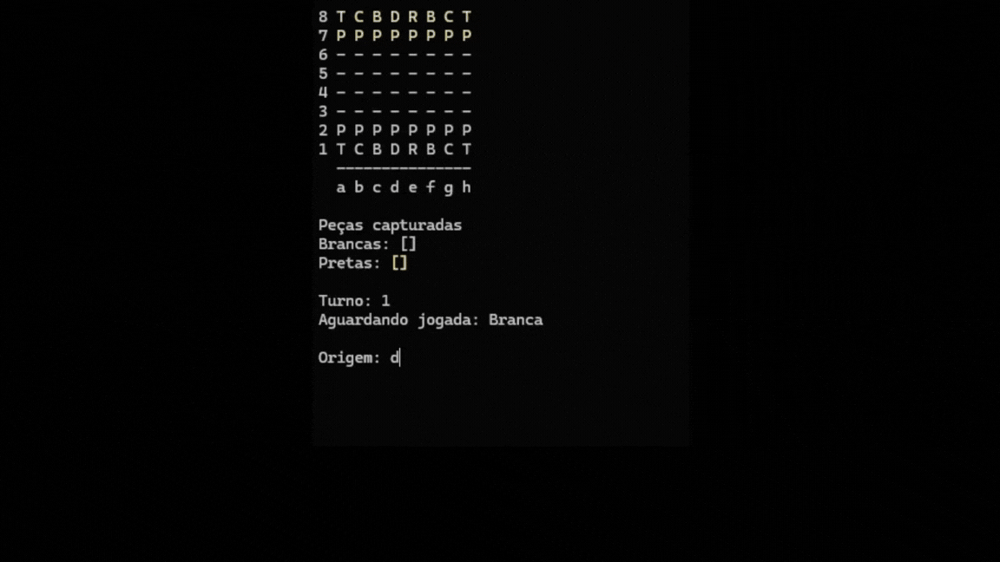

# ♟️Console Chess♟️

Este projeto é uma aplicação de console desenvolvida em C#, que implementa todas as regras e mecânicas de um jogo de xadrez completo. 
Ideal para fins educacionais, prática de lógica de programação orientada a objetos.

---

## ✅ Funcionalidades
* ♜ Tabuleiro 8x8 com renderização em ASCII
* ♛ Todas as peças implementadas: Peão, Torre, Cavalo, Bispo, Rainha e Rei
* 📌 Exibição dos movimentos possíveis de uma peça
* 🧱 Estrutura organizada com tratamento de exceções específicas para regras do jogo
* 🕹️ Interface por terminal simples e intuitiva

---

## 🧠 Regras oficiais do xadrez:
* Movimento válido de cada peça
* Troca de turnos
* Captura de peças
* Xeque e xeque-mate
* Validação de posições de origem e destino

---

🛠️ Tecnologias Utilizadas
* Linguagem: C#
* IDE: Visual Studio 2022
* Paradigma: Programação Orientada a Objetos (POO)

---

📁 Estrutura do Projeto
* xadrez-console/
* xadrez/ → Lógica das peças e regras do xadrez
* tabuleiro/ → Implementação do tabuleiro e posições
* Program.cs → Classe principal (ponto de entrada)
* Tela.cs → Impressão e leitura no console

---

🚀 Como Executar
Clone o repositório:

```bash
Copiar
Editar
git clone https://github.com/seu-usuario/xadrez-console.git
Abra o projeto no Visual Studio 2022

Execute com Ctrl + F5 ou pelo botão de execução
```

---

# 🕹️ Como Jogar
O jogo é totalmente controlado pelo teclado, direto no console. Veja como funciona:

🎯 Objetivo
* Capture o rei adversário seguindo as regras oficiais do xadrez.

▶️ Instruções Passo a Passo
* Escolha a origem:
* Digite a posição da peça que você deseja mover.
* Exemplo: e2 (peão branco da frente).

Visualize os movimentos possíveis:
* O sistema exibirá o tabuleiro com os movimentos possíveis destacados.

Escolha o destino:
* Digite a posição para onde você quer mover a peça.
* Exemplo: e4

O jogo atualiza:
* O tabuleiro será atualizado com a nova posição da peça.
* Se uma peça for capturada, ela será listada na área de "Peças capturadas".

Turno alternado:
* O jogo informa qual jogador (brancas ou pretas) está com a vez.


